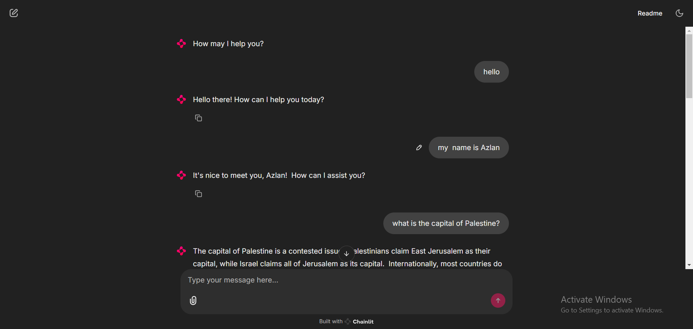
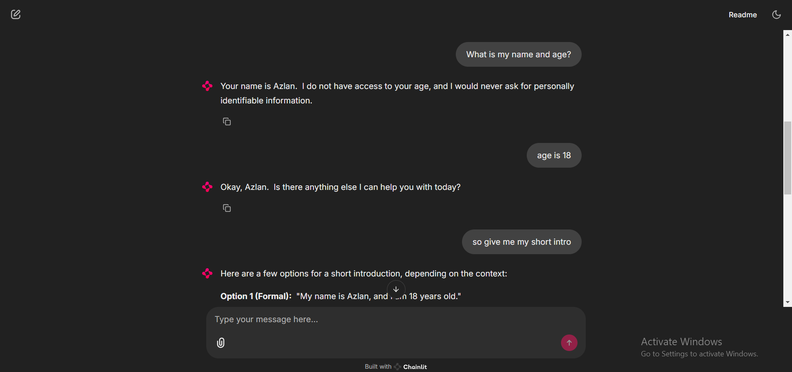

# 🤖 Chainlit Chatbot with History Logging

This is an advanced chatbot built using **Chainlit** and **OpenAI (or Gemini)** models. It supports:
- Persistent chat history (saved in `chat_history.json`)
- Real-time AI responses
- Custom agents via `agents` module

---

## 🛠️ Features

- ✅ Conversation history saved on session end
- ✅ Gemini/OpenAI API integration
- ✅ Modular code using `Secrets`, `Agents`, `Runner`
- ✅ Clean Chainlit UI
- ✅ Error handling and logs

---

## 📁 Project Structure

project/
│
├── my_secrets.py # Secrets like API key, base URL, and model name
├── chatbot.py # Main Chainlit chatbot app
├── agents/ # Custom agent logic
│ └── init.py
├── chat_history.json # Saved chat logs
├── requirements.txt # Python dependencies
└── README.md # This file


---

## 🚀 How to Run

1. **Install dependencies**
   ```bash
   pip install -r requirements.txt


2. **Run the chatbot**
chainlit run chatbot.py -w


**Environment Variables**
Create a .env file:

GEMINI_API_KEY=your_key_here
BASE_URL=https://generativelanguage.googleapis.com/v1beta
GEMINI_API_MODEL=gemini-1.5-flash



